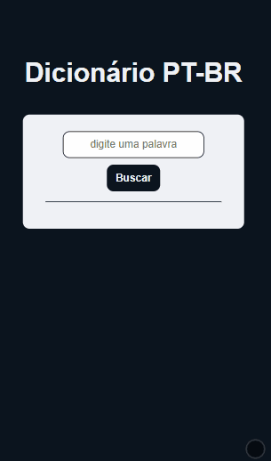
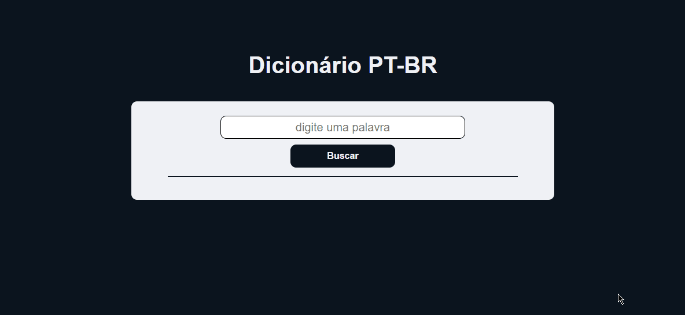

<h1 style='font-size: 40px'>Dictionary</h1>

In this project I developed a dictionary, consuming an API, with meanings for words in pt-br

- API used: <a href="https://github.com/ThiagoNelsi/dicio-api">@ThiagoNelsi</a>
 

mobile version

desktop version

<h2 style='font-size: 25px'>the following technologies were used for the development of the application:</h2>

- HTML5

- CSS3

- Typescript
